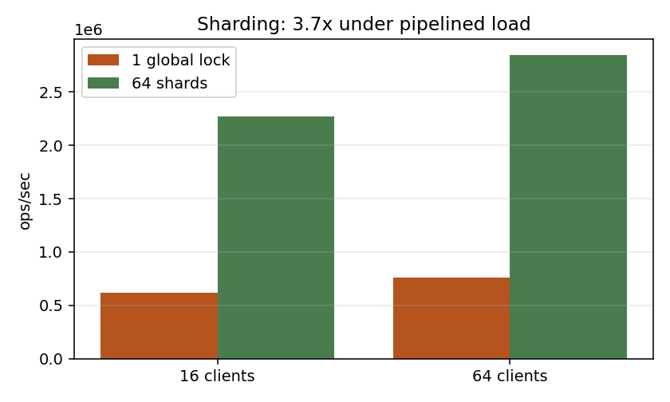

# kvstore

A sharded, crash-safe key-value store in C++20 that speaks the Redis
wire protocol. Built to find out where concurrent servers actually
lose performance — and measured at every step.

## Results

| change | effect | measured |
|---|---|---|
| 64-way lock striping | **3.7x** throughput | 0.76M → 2.85M ops/sec, c=64 pipelined |
| epoll event loops | **154x** fewer threads | 2001 → 13 threads @ 2000 connections |
| cache-line padding | **1.5x** in isolation | invisible under realistic load |
| group commit | **8.6x** over per-write fsync | 407 → 3,493 ops/sec |

12-core host under WSL2, client and server co-resident. Medians of 3
runs. Environment in `bench/results/environment.txt`.

## What I got wrong, and how I found out

**The first benchmark measured the client, not the server.** Throughput
was flat at 46k across every client count. I assumed lock contention.
It wasn't: `--threads 8 -r 1000000` gave 240k with no server change at
all. The default `redis-benchmark` is single-threaded and uses one key,
so every request hit the same shard.

**An fsync measurement on /tmp read 0.001 ms.** /tmp is tmpfs — a RAM
filesystem where fsync is a no-op. On the WAL's real filesystem it is
2.451 ms.

**A commit delay made things worse.** It doubled batch size (6.5 → 12.0)
but cut throughput 38%. Commit delay assumes writers arrive
independently of commit completion; with blocking WAL calls inside
event loops, arrival is gated by completion, so lingering recruits
nobody.

## Design
See `docs/design.md`. Full measurements in `bench/results/notes.md`.

## Build and run
...